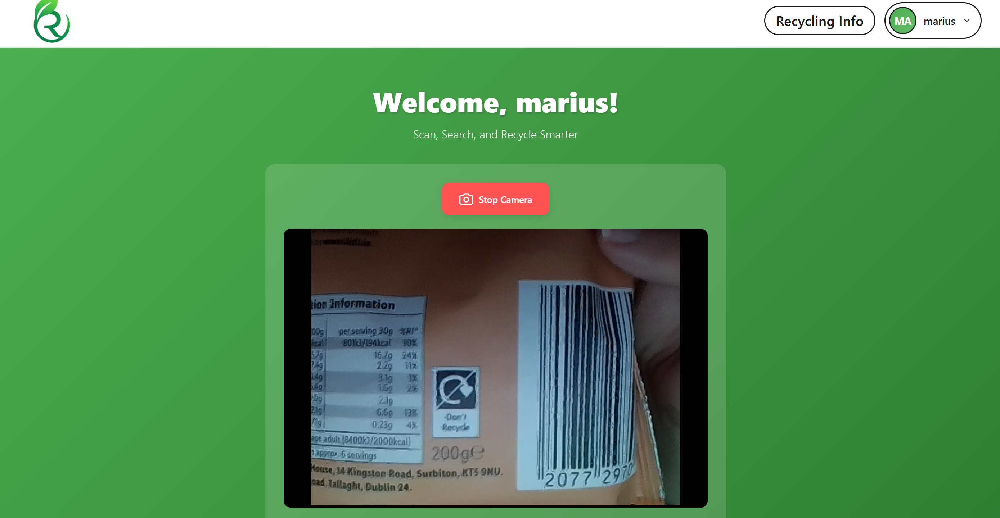
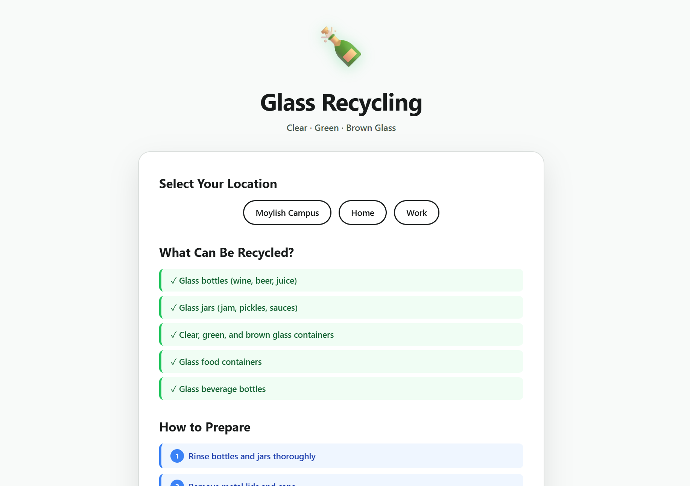
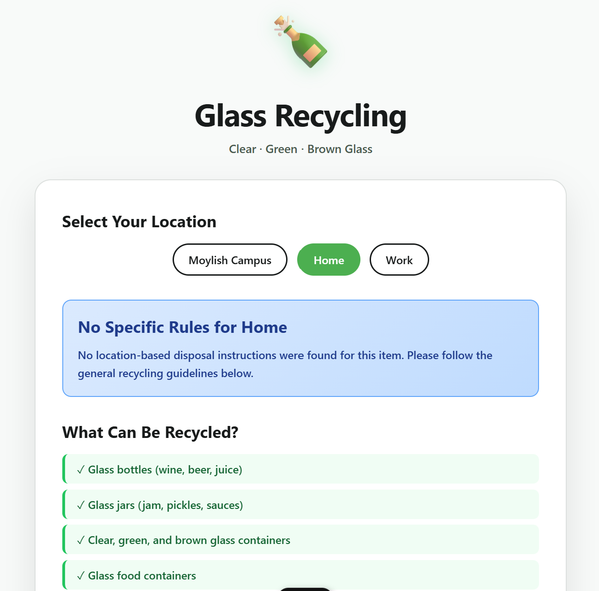
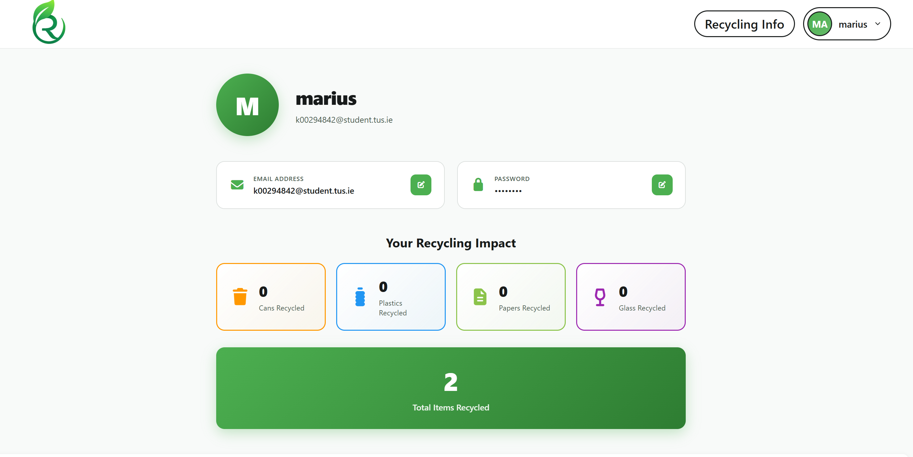
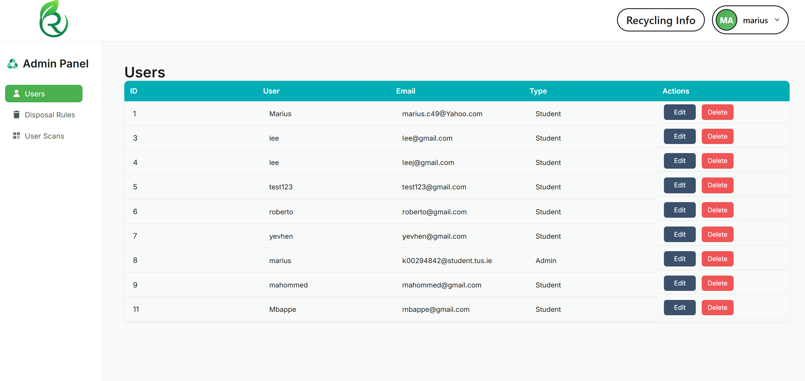
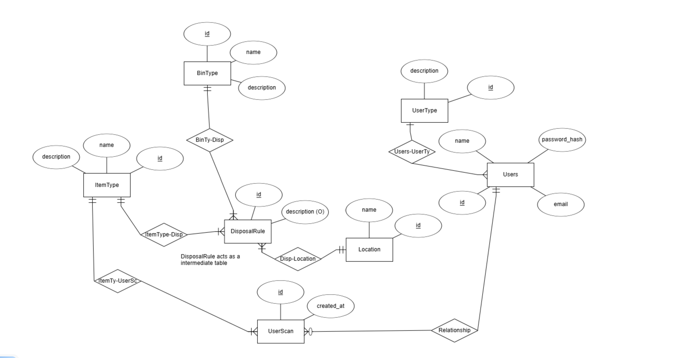

# Renova – TUS Recycling Web Application

Renova is our group project for the TUSBinRight+ assignment.  
The aim was to build a **responsive web application** that helps users correctly dispose of waste by scanning barcodes or manually selecting item types, while supporting **location-based bin rules** and providing a **complete admin panel**.

The system was required to:
- Scan barcodes/QR codes  
- Identify item type and disposal method  
- Support manual input when scanning fails  
- Provide bin colour and preparation steps  
- Apply location-specific rules  
- Guide users when no match is found  
- Log missing items for admin review  
- Include user accounts and admin features  

Renova implements all these requirements and adds extra features like CO₂ statistics, multi-delete tools, and a user-friendly dashboard.

---

# 🔧 Project Setup

## Backend Setup (Branch: `backend`)
1. Place the **backend branch** into your **htdocs** directory (e.g., XAMPP).  
2. Open the `.env` file and update your database credentials if required.  
3. Import the SQL dump:

## Frontend Setup (Branch: `master`)
You can run the frontend anywhere, but **htdocs is recommended**.

1. Open the frontend folder  
2. Install dependencies:
3. Run the app:

## Recommended Login (Admin Access)
**Email:** `k00294842@student.tus.ie`  
**Password:** `marius`  

This account has **admin privileges**.  
Newly created users work normally but are **not admins** unless updated manually in the database.

---

# 📸 Application Features

## 🔍 Barcode Scanning System
Users scan items with the device camera.  
Renova identifies the item (plastic, paper, can, bottle).  
If scanning fails, users can manually select the type.

## 🗂️ Waste Type Identification
After scanning or selecting manually, the item type is confirmed and saved.  
The user is redirected to the appropriate waste-type information page.

## 📍 Location-Based Disposal Rules
Users choose a location such as **Home**, **Work**, or **Moylish Campus**.  
Renova shows the correct **bin colour** and any required preparation steps.

## 👤 User Profile
Users can update their email and password.  
They can also view statistics showing their recycling activity.

## 📊 CO₂ Savings & Statistics (Chart.js)
Graphs show:
- Scans per waste type  
- Overall progress  
- Targets  
- Estimated CO₂ saved  

## 🛠️ Admin Panel
Admins can:
- Manage disposal rules  
- Edit/delete users  
- View and delete user scans  
- Filter scans by email  
- Multi-delete scans with checkboxes  

---

# 🗄️ Database Design

Add your diagram here:

---

# 🎯 Conclusion

Overall, we’re really happy with how Renova turned out. We worked well together as a group and managed to build a system that not only meets the TUSBinRight+ requirements but goes a bit further with extra features like statistics, CO₂ tracking and a solid admin panel. It was a challenging project at times, but we learned a lot throughout the process and we’re proud of what we achieved as a team.

